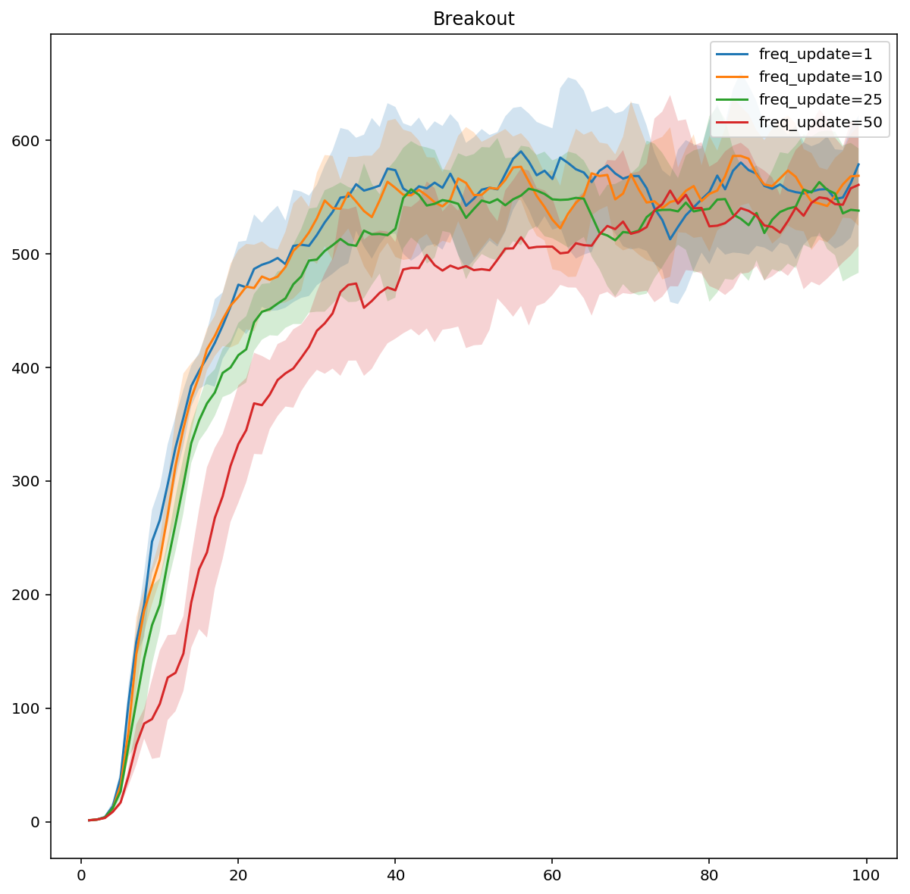

Atari
==============

How to run
----------

Run the following command to compile:
```
sh ./install.sh
```

Then start training using A2C:
```
cd build
python -u ../run.py --gpu 0 --num_game_thread 1024 --batchsize 128 --reward_clip 1 --adv_clip 1.0 --ratio_clamp 1.5
```

Some switches
-------------

You can add `--freq_update 1` to specify how frequent the actor is updated to match with the train models.

You can also add `--num_eval_games 16 --num_game_thread 1040` to have an additional 16 separate game threads for evaluation purpose. In that case, it will print:
```
Train:
Total step: 50.4106M, #step (completed episode): 48.5521M
Accumulated: 189.89[25825], Last episode[1024] Avg: 422.106, Min: 27, Max: 864

Eval:
Total step: 0.985212M, #step (completed episode): 0.946201M
Accumulated: 236.441[399], Last episode[16] Avg: 585.688, Min: 354, Max: 864
```
Note that `585.688` is the average reward the evaluation process gets (over the most recent 16 ones). 

Performance
-----------

Number of frames used in training (in millions) versus Evaluation performance.

~10 mins per million frames. 


